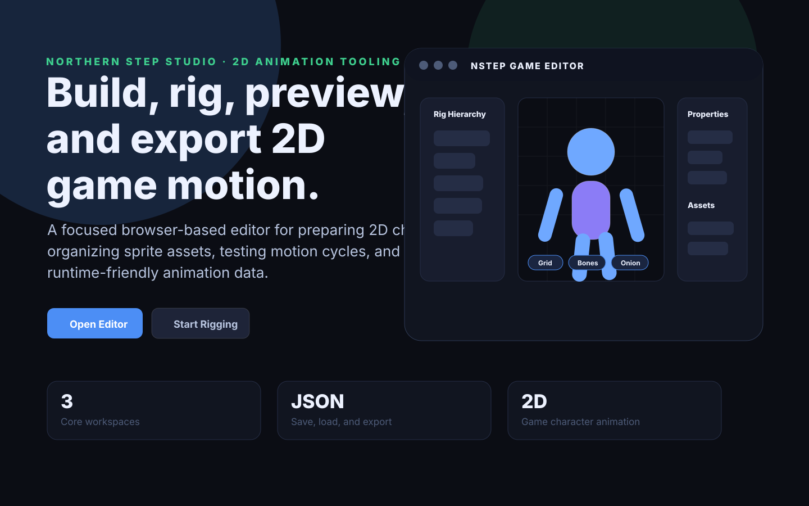
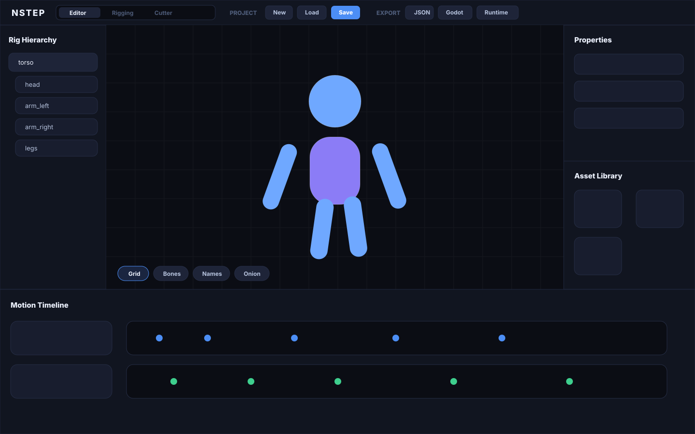

# NStep Game Editor

**NStep Game Editor** is a browser-based 2D game character motion editor built for Northern Step Studio. It helps indie developers and small teams prepare sprite-based characters, organize rig parts, preview motion, and export animation data for game runtimes.



## What the project does

NStep Game Editor gives a focused workspace for building 2D character motion from sprite pieces. The app is designed around a practical asset-to-animation workflow:

1. Create or load a project.
2. Cut and organize sprite assets.
3. Build a rig hierarchy from character parts.
4. Preview motion on a canvas.
5. Edit animation timing and controller data.
6. Export the result for external game engines or runtime code.

The goal is to make a lightweight production tool that can support custom 2D characters, enemy sprites, hero samples, and reusable motion data without requiring a full commercial animation suite.

## Who it is for

This project is intended for:

- indie game developers building 2D games
- small studios that need an internal animation workflow
- prototype teams testing sprite rigs and movement cycles
- developers exporting animation data into Godot, Canvas2D, or custom runtimes

## Core workspaces

### Overview

A professional landing/overview page explains what the editor is for, shows the product direction, and gives quick actions for opening the editor or starting the rigging workflow.

### Editor

The main editor includes:

- project controls for creating, loading, saving, and renaming projects
- sample hero and enemy loaders
- a rig hierarchy panel
- a central preview canvas
- canvas tools for grid, bones, names, onion skinning, reset, fit, and zoom
- movement preview controls for walking/running and directional testing
- a properties inspector
- an asset library
- a motion timeline
- export buttons for JSON, Godot, and Canvas2D runtime output



### Rigging

The rigging workspace is used to prepare character part relationships before animation work. It is the place for structuring character pieces so the editor can treat them as a usable animated rig.

### Cutter

The cutter workspace is used for turning source sprite art or sheets into usable parts that can be organized into the asset library and connected to a rig.

## Current feature highlights

- Vite + TypeScript browser app
- local project save/load flow
- autosave support
- sprite/asset organization
- rig hierarchy management
- canvas-based motion preview
- animation timeline UI
- movement preview pad
- JSON export
- Godot-oriented export
- Canvas2D runtime export

## Tech stack

- **Vite** for the frontend dev server and production build
- **TypeScript** for app logic
- **HTML/CSS** for layout and custom editor UI
- **Canvas2D** for the motion preview surface

## Getting started

Clone the repository:

```bash
git clone https://github.com/NorthernStepStudio/game-editor.git
cd game-editor
```

Install dependencies:

```bash
npm install
```

Start the development server:

```bash
npm run dev
```

Create a production build:

```bash
npm run build
```

Preview the production build:

```bash
npm run preview
```

## Project structure

```text
.
├── docs/
│   └── screenshots/
│       ├── editor-preview.svg
│       └── overview-preview.svg
├── packages/
│   └── nstep-motion-core/
├── src/
│   ├── app/
│   ├── input/
│   ├── motion-editor/
│   ├── persistence/
│   ├── rigging/
│   ├── sprite-cutter/
│   ├── state/
│   ├── main.ts
│   ├── professional-view.css
│   └── style.css
├── index.html
├── package.json
└── tsconfig.json
```

## Development notes

The app currently runs as a client-side browser editor. Project persistence is handled locally in the browser, and exports are generated from the project state. Because this is an editor-style app, UI stability, state safety, and export correctness are the most important areas to test as the project grows.

Recommended next improvements:

- add automated build checks in GitHub Actions
- add a small sample project fixture for demos and testing
- add real captured screenshots after deploying the app or running it locally
- document the JSON export schema
- add keyboard shortcut documentation
- add a public roadmap or issue list for planned editor features

## Status

This is an active Northern Step Studio tool. The current version is focused on the MVP editor workflow and professional presentation of the project.

## License

No license has been added yet. Add one before distributing or accepting outside contributions.
